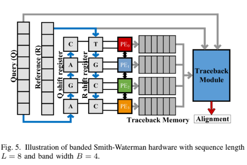
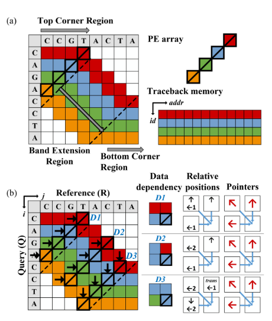

# Banded Smith Waterman Genome Alignment
This repo implements both software and hardware version of Banded Smith Waterman algorithm
## What is BSW
> It resembles SW algorithm, while BSW only calculate a banded region on the DP table to minimize calculation.
### software
* run BSW.py
* check out the result between two sequences both with 256 genomes
### hardware
* check RTL design
  > 1. source license.sh 
  > 2. vcs tb_BSW.v +define+RTL -full64 -R -debug_access+all +v2k +notimingcheck
* check SYN result
  > vcs tb_BSW.v +define+SDF -full64 -R -debug_access+all +v2k +notimingcheck  
### Block Diagram
* I did not implement the traceback part  

### Reference
> please check out: https://ieeexplore.ieee.org/document/8445105  
